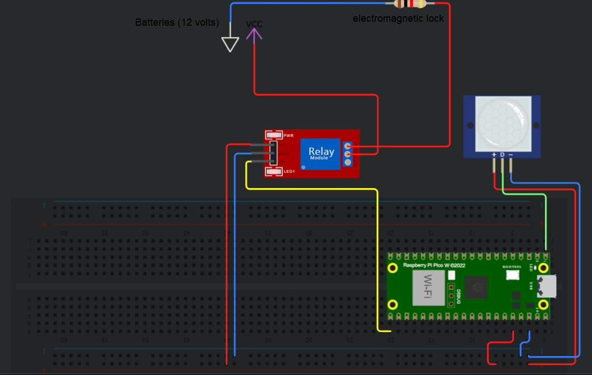

# Greenhoues monitoring
Nicolas Stuhm | ns223de

The device resulting from this project should be installed in/on a greenhouse and has the following capabilities: it measures the temperature in the greenhouse and based on the values obtained, a door is opened. It comes furthermore with a movement detector, which notifies the user via a message on the phone when triggered, as there might be a cat or rabbit in the greenhouse.

### Estimated time needed for this project: 3 hours
<br>

# Objective
The reason I chose this project is that I myself am living on a farm together with some friends of mine and I intend to make our lifes a little easier with this device. The temperature sensor makes it unnecessary to walk to the remote greenhouse, as it lets the user observe the values online. Based on those, one can estimate how often the plants need water throughout the day and furthermore, the door of the greenhouse opens automatically in the morning, when the temperature rises above a certain temperature. Previous cases have led me to include a motion detector, as there had been cats or other animals digging in the soil or destroying the tomato- or other plants.

The insights this project will hopefully provide to those reproducing it are:
- a general understanding of how IoT devices operate
- some knowledge about electronic circuits
- some knowledge about coding in (micro)python
- the capability to work with IFTTT as well as adafruit.io
<br><br>

# Material
| component                                                                                                                                                                  | purpose                                                                                                                                  | where to buy   | cost         |
|----------------------------------------------------------------------------------------------------------------------------------------------------------------------------|------------------------------------------------------------------------------------------------------------------------------------------|----------------|--------------|
| RPI Pico W                                                                                                   | This is the microcontroller, which is taking care of connecting to the internet and managing the other electronic parts of this project. | electrokit.com | in a package |
| Jumper wires                                            | The jumper wires server the purpose of connecting the different parts of the project with eachother.                                     | electrokit.com | in a package |
| Breadboard                                                                            | The breadboard is the base, where connections from the pico to for instance the relay are made.                                          | electrokit.com | in a package |
| Relay                                                                                  | The relay activates the electromagnetic lock when told so by the pico.                                                                   | ebay.com       | 10 kr        |
| Electromagentic lock                                                                            | This lock keeps the door closed until activated by the pico, which leads the door to swing open.                                         | ebay.com       | 50 kr        |
| PIR motion sensor                                                                              | This sensor detects motion in the greenhouse, for instance from unwanted visitors like cats or rabbits.                                  | ebay.com       | 20 kr        |
| Batteries  | Eight of these AA batteries connected in series are necessary to provide the electromagnetic lock with enough volts(12) to open.          | ICA            | 50 kr        |

In addition, I build a little box out of wood, as I needed some kind of container to connect the eight batteries in series.<br>
The last part one might need in case the door does not fall open by itself, is a feather/spring to keep the door under tension, such that it opens as soon as the lock is triggered.
<br><br>


# Setup
My subject of studies lies within the realm of IT, so I did not have to go about installing a lot of software. The IDE I am using is Visual Studio Code, with the plugins flake8 and Pico-W-Go. I had, in the beginning, installed Thonny, in order to test and try it, however, I thought it is somewhat limited and one would have more opportunities using VS code.<br>
The flashing, that is the installation of the new firmware (uf2 file), I had to do on a different computer, as mine did not recognise the pico W as mass storage space and I was therefore not able to copy the file needed to it. The process is simple. One must plug the pico W in with an USB cable, while holding down the BOOTSEL button on the board. Now the computer should "see" the micorcontroller like a simple USB stick and a certain file containing firmware, which can be found online, must be copied to it. After that, disconnect and connect the pico W again.<br>
Another problem arose during connecting the pico W to my IDE. I had to disable the "Auto Connect" option in the Pico-W-Go extension and specified the port "COM6" in the "Manual Com Device" (also part of the Pico-W-Go extension), in order for it to work.<br>

For you with a well functioning laptop this might not be necessary, but I also had to install a new driver for the pico w to be recognised by my computer.
<br><br>

# Physical- and web connectivity
The wiring is fairly simple and can be seen in figure one. Both the relay and the PIR sensor are connected to a ground- and 3 volts rail at the bottom of the breadboard, which is connected to the pico W. The relay is furthermore connected to pin GP16 and the sensor to GP0 on the microcontroller. There are two more terminals used on the realy: COM (common) and NC (normally closed). The COM port is connected with the positive terminal of the batteries, while the NC is connected to the positive end of the electromagnetic lock (represented by a resistor in the diagram). The circuit is then closed by a connection between the negative terminal of the lock and the ground of the batteries.<br><br>

_Figure one, physical setup diagram_<br><br>

When starting the project, I intended to use a transformer or two 9 volt batteries and limit them down to 12 volts with a 10k and 15k resistor, however the final descision fell on eight 1.5 volts batteries connected in series to get the desired output. This setup is the most energy- and cost efficient solution, which in theory could be used for production.

Concerning the websites and platforms, I am using adafruit io and IFTTT. Adafruit is a website, which provides so called "feeds" which accept data from for example a microcontroller. I am using two different feeds, one for the temperature and one to monitor if the pir sensor has detected motion. This data is the visualised by a different tool within adafruit: the dashboard: <br><br>

Starting with the gauge on the left in figure two: it displays the current temperature, is capped at -5 and 75 degrees celsius and changes colors to blue or red when falling below 15 or rising above 45 degrees, respectively. These values are not predefined and one can easily be modified.<br>
One the right in figure two, a chart keeps track of the development of the temperature over the past 24 hours. Both of these visualisation tools, along with many others, can be found under adafruit.io, dashboard, settings and finally add block.

_Figure two, gauge and chart dispalying the temperature_<br><br>
Visible on the left is a log, keeping track of when the door was opened and when the pir sensor was triggered. The textfield on the right, lets a user enter a value, such as "open" which is then added to the feed and executed, in case the codeword has a predefined action the code. This is not the standard way of opening the lock, it either opens by itself, reacting to the temperature in the greenhouse or it can be opened by a pushbutton in the IFTTT application (more on that soon). This textfield is some kind of "backdoor".

_Figure three, log for pir and door + textfield_<br>

With the other service, IFTTT, one can create applets, which in my case read certain values from one of my adafruit feeds and send a message to my phone that the pir sensor had been triggered. The limit is at two applets, however one can choose a paid subscription to unlock more. Using this app, I have added a pushbutton to my homescreen, that, when pressed, sends the value "open" to the corresponding feed, which in turn opens the lock.<br>


_Figure four, button to open the lock_

# The code
```python
import time
import ubinascii
from lib.simple import MQTTClient
import machine
```
Three of the imports, namely time, ubinascii and maschine can simply be copied. The last one, MQTTClient, requires you to run the following command in your terminal: ``pip install micropython-umqtt.simple``

The import should then look like this:
```python
from umqttsimple import MQTTClient
```
However, for some reason the file containing the MQTTClient class had a different name, which forced me to change the name in the import. In case you run into the same issue, I used the ``os`` library in python and the terinal to retrieve the name.

The following block of code simply contains variable and pin definitions:
```python
CLIENT_ID = ubinascii.hexlify(machine.unique_id())
MQTT_BROKER = "io.adafruit.com"
PORT = 1883
ADAFRUIT_USERNAME = # your username
ADAFRUIT_PASSWORD = # your password
# this topic receives the temperature data (every 15 seconds)
PUBLISH_TOPIC_ONE = b'your publish topic key'
SUBSCRIBE_TOPIC_TWO = b'your subscribe topic key'
# this topic receives the dynmaic pir sensor data
PUBLISH_TOPIC_TWO = b'your publish topic key'

last_publish = time.time()
publish_interval = 15

led = machine.Pin("LED", mode=machine.Pin.OUT)
led.off()
pico_temp = machine.ADC(4)
factor_celsius = 3.3 / (65535)
relay = machine.Pin("GP16", mode=machine.Pin.OUT)
motion_interrupt = machine.Pin("GP0", mode=machine.Pin.IN,
                               pull=machine.Pin.PULL_DOWN)
motion_detect = False
time.sleep(2)
```
The ``pico_temp`` and ``factor_celsius`` are there to take the temperature reading of the pico w and turn the value into a number of degrees in celsius. One can also choose to convert to fahrenheit.


The following code snippet shows the majority of the functions I am using.
```python
# definition of an interrupt function
def interrupt(pin):
    global motion_detect
    motion_detect = True


# if the pin the pir sensor is connected to changes its value
# from 0 to 1 (log to high), the interrupt function from
# above is called and the global variable is set
motion_interrupt.irq(trigger=machine.Pin.IRQ_RISING, handler=interrupt)


# with this funtion, the global variable from above is checked
# and acted upon depending on its state
def detect():
    global motion_detect
    if motion_detect:
        motion_detect = False
        return True


# this function "receives" the messages from adafruit.io
def sub_cb(topic, msg):
    print((topic, msg))
    if msg.decode() == "open":
        openDoor()


# reset the pico in case an error in main had been encountered
def reset():
    print("Resetting...")
    time.sleep(5)
    machine.reset()


# open the lock, wait for five seconds such that the door
# can swing open and close to save battery
def openDoor():
    relay.high()
    time.sleep(5)
    relay.off()


# this function reads the temperature from the built in temp
# sensor on the pico W
def get_temperature_reading():
    reading = pico_temp.read_u16() * factor_celsius
    return 27 - (reading - 0.706) / 0.001721
```

And finally the main function, connecting to adafruit with the credentials defined above and executing the corresponding functions to send the temperature and movement detection signals to the adafruit.io feeds.
```python
def main():
    # some code copied from the course material, which serves
    # to connect the pico to adafruit.io
    print(f"Begin connection with MQTT Broker :: {MQTT_BROKER}")
    mqttClient = MQTTClient(CLIENT_ID, MQTT_BROKER, PORT, ADAFRUIT_USERNAME,
                            ADAFRUIT_PASSWORD, keepalive=60)
    mqttClient.set_callback(sub_cb)
    mqttClient.connect()
    mqttClient.subscribe(SUBSCRIBE_TOPIC_TWO)
    print(f"Connected to MQTT  Broker :: {MQTT_BROKER}")

    # variables for the door (see further down)
    doorOpen = False
    lastReset = time.time()
    # initialising temp, because it cannot be "nothing"
    temp = 15
    while True:
        try:
            global last_publish
            # check for a message from adafruit
            mqttClient.check_msg()
            # if something is detected, publish it on adafruit
            # which leads to a pop up on the phone
            if detect():
                mqttClient.publish(PUBLISH_TOPIC_TWO, "detect".encode())
            # send the current temp every 15 sec to adafruit
            if (time.time() - last_publish) >= publish_interval:
                temp = get_temperature_reading()
                mqttClient.publish(PUBLISH_TOPIC_ONE, str(temp).encode())
                last_publish = time.time()
            # open the door based on the temperature
            if not doorOpen and temp > 15:
                # set doorOpen to true, such that the lock is
                # not opened whenever the temp is over 15
                # (quite ofter throughout the day)
                doorOpen = True
                openDoor()
            # reset doorOpen openafter one day
            # ideally this device should be initialised
            # early in the morning
            if (time.time() - lastReset) >= 86400:
                doorOpen = False
                lastReset = time.time()
        except Exception as error:
            print(error)
```
# Connectivity
I am using wifi and the MQTT protocol to send data from my microcontroller to the adafruit website. I decided to send a temperature reading every 15 seconds and the pir sensor, obviously, sends whenever it is triggered. The second platform, IFTTT (installed on my phone), is connected via a webhook to the adafruit website and pops a notification whenever the value "detect" arrives in the adafruit feed.


# Final thoughts
This project did not go as intended as firstly non of the hardware worked (due to my laptop I guess) and second, midway through the course I found out that my project had to act upon sensory data and I therefore had to shift it completely.<br><br>
In addition, I am certainly not satisfied with the final product and would like to implement a few more things. I wanted to buy a new DHT11, as mine burned out in the last week, such that I could show a humidity measurement on my dashboard and act upon those readings. Other ideas are soil moisture sensor to check when the plants need more water, a buzzer, which is beeping at a certain frequency, in order to scare away cats or other animals or a camera, which is activated when the pir sensor detects something, such that one could check if there actually is an animal in the greenhouse.

On the positive side, the courese touched on many aspects of the IoT and I am happy I could extend my knowledge a bit.<br><br>
Here some pictures of the final product:


